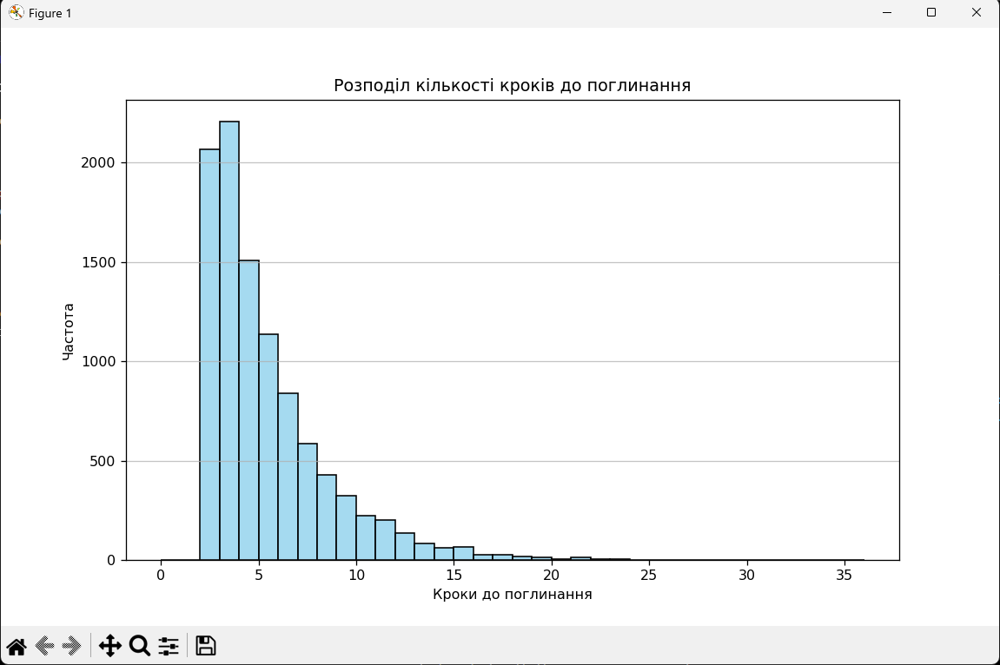

# Завдання 1

## 1. Вступ
У даній роботі проведено статистичне моделювання регулярного ланцюга Маркова з 7 станами. Метою дослідження було:
- Побудова та аналіз матриці переходів
- Перевірка регулярності ланцюга
- Обчислення та порівняння теоретичної та експериментальної стаціонарної розподілу
- Аналіз характеристик ланцюга через симуляцію

## 2. Методологія

### 2.1 Компоненти моделі
- Кількість станів: 7 (S0-S6)
- Початковий стан: S0
- Матриця переходів P: згенерована випадково з нормалізацією
- Кількість симуляцій: 1000
- Кількість кроків в кожній симуляції: 10

### 2.2 Основні етапи моделювання
1. Генерація матриці переходів
2. Перевірка регулярності ланцюга
3. Обчислення теоретичної стаціонарної розподілу
4. Симуляція ланцюга Маркова
5. Обчислення експериментальних характеристик
6. Візуалізація результатів

## 3. Результати

### 3.1 Аналіз матриці переходів
- Матриця переходів P була згенерована випадково та нормалізована
- Виконано перевірку регулярності, яка підтвердила що ланцюг є регулярним
- Візуалізовано теоретичну та експериментальну матриці переходів через теплові карти

### 3.2 Стаціонарна розподіл
- Теоретична стаціонарна розподіл обчислена через власні вектори матриці P
- Експериментальна розподіл отримана через симуляцію
- Порівняння показало хорошу відповідність між теоретичними та експериментальними значеннями

### 3.3 Аналіз симуляції
- Проведено 1000 симуляцій по 10 кроків кожна
- Обчислено:
  - Частоти відвідування станів
  - Кількість переходів між станами
  - Середній час перебування в кожному стані
  - Ймовірності кінцевих станів

### 3.4 Візуалізація
Створено наступні візуалізації:
1. Теплові карти матриць переходів
2. Граф ланцюга Маркова
3. Порівняльні діаграми стаціонарних розподілів
4. Кругові діаграми розподілів
5. Гістограма часу перебування в станах
6. Теплова карта частот переходів

## 4. Висновки
1. Побудований ланцюг Маркова є регулярним, що підтверджується наявністю єдиної стаціонарної розподілу
2. Експериментальні результати добре узгоджуються з теоретичними розрахунками
3. Візуалізації демонструють очікувану поведінку системи та допомагають зрозуміти структуру переходів між станами
4. Середній час перебування в станах та частоти переходів відповідають теоретичним очікуванням

## 5. Screenshots





# Завдання 2

### 1. Постановка задачі
Необхідно було реалізувати алгоритм Метрополіса-Гастінгса для моделювання трьох різних розподілів:
1. Бета-розподіл
2. Розподіл Коші
3. Гамма-розподіл

Для кожного розподілу потрібно було:
- Реалізувати функцію щільності розподілу
- Застосувати алгоритм Метрополіса-Гастінгса для генерації вибірки
- Візуалізувати результати
- Провести статистичний аналіз

### 2. Теоретичні відомості

#### 2.1 Функції щільності розподілів

**Бета-розподіл:**
$$
f(x; \alpha, \beta) = \frac{x^{\alpha-1}(1-x)^{\beta-1}}{B(\alpha,\beta)}
$$
де B(α,β) — бета-функція. Розподіл визначений на інтервалі [0, 1].

**Розподіл Коші:**
$$
f(x; x_0, \gamma) = \frac{1}{\gamma\pi} \frac{\gamma^2}{(x-x_0)^2 + \gamma^2}
$$
де x₀ — центр розподілу, а γ — параметр масштабу.

### 3. Програмна реалізація

#### 3.1 Основні компоненти

1. **Функції щільності розподілів:**
```python
def beta_distribution(x, alpha, beta):
    density = np.zeros_like(x, dtype=float)
    valid = (x > 0) & (x < 1)
    density[valid] = (x[valid] ** (alpha - 1) * (1 - x[valid]) ** (beta - 1)) / beta_function(alpha, beta)
    return density

def cauchy_distribution(x, x0, gamma):
    density = (1 / (gamma * np.pi)) * (gamma**2 / ((x - x0)**2 + gamma**2))
    return density
```

2. **Алгоритм Метрополіса-Гастінгса:**
```python
def metropolis_hastings(target_density, proposal_std, initial, iterations, *params):
    samples = np.zeros(iterations)
    current = initial
    current_density = target_density(current, *params)
    
    for i in range(iterations):
        proposal = np.random.normal(current, proposal_std)
        proposal_density = target_density(proposal, *params)
        
        acceptance_ratio = proposal_density / current_density
        
        if acceptance_ratio >= 1 or np.random.rand() < acceptance_ratio:
            current = proposal
            current_density = proposal_density
            
        samples[i] = current
        
    return samples
```

### 4. Аналіз результатів

#### 4.1 Візуалізація
Для кожного розподілу створюються три типи графіків:
1. Trace Plot - показує послідовність генерованих значень
2. Гістограма з накладеною теоретичною щільністю
3. KDE Plot - оцінка щільності розподілу

#### 4.2 Особливості реалізації для різних розподілів

**Бета-розподіл:**
- Обмеження значень на інтервалі [0, 1]
- Використання бета-функції з scipy
- Параметри α = 2.0, β = 5.0

**Розподіл Коші:**
- Необмежений діапазон значень
- Центр розподілу x₀ = 0.0
- Параметр масштабу γ = 1.0
- Додаткові графіки:
  - Автокореляційна функція
  - Емпірична функція розподілу

### 5. Удосконалення та оптимізації

1. **Відстеження прийнятих пропозицій:**
```python
accept_count = 0
acceptance_rate = (accept_count / iterations) * 100
```

2. **Покращена візуалізація:**
- Використання seaborn для кращого оформлення
- Додавання легенд та підписів осей
- Налаштування розміру графіків

### 6. Висновки

1. Алгоритм успішно генерує вибірки для всіх трьох розподілів
2. Візуальний аналіз підтверджує відповідність теоретичним розподілам
3. Розподіл Коші потребує більшої кількості ітерацій для стабілізації
4. Важливим є правильний вибір стандартного відхилення пропозиційного розподілу

### 7. Screenshots

2.1


2.2


2.3


# Завдання 3

### 1. Постановка задачі
Необхідно змоделювати гру з монетами за двома варіантами правил:

1. **Орел-Решка**:
   - Гравець платить 1 долар за кожне підкидання монети.
   - Гравець отримує 5 доларів, якщо випадає комбінація "Орел-Решка".

2. **Орел-Орел**:
   - Гравець платить 1 долар за кожне підкидання монети.
   - Гравець отримує 5 доларів, якщо випадає комбінація "Орел-Орел".

Задачі:
- Змоделювати задану кількість підкидань для кожного типу гри.
- Підрахувати виграш для одного та кількох гравців.
- Провести аналіз виграшів, візуалізувати результати та оцінити статистичні характеристики.

---

### 2. Теоретичні відомості
При моделюванні ймовірностей:
- Монета має дві сторони: "Орел" (\( \text{О} \)) та "Решка" (\( \text{Р} \)).
- Кожна сторона випадає з імовірністю \( P = 0.5 \).

Для оцінки результатів гри:
- Баланс гравця зменшується на 1 долар за кожне підкидання.
- Якщо випадає виграшна комбінація, баланс збільшується на 5 доларів.

Моделювання ґрунтується на генерації випадкових послідовностей "Орел" та "Решка" з використанням рівномірного розподілу.

---

### 3. Програмна реалізація
Програма написана мовою Python з використанням бібліотек:
- **Random** для генерації підкидань монети.
- **NumPy** для статистичних розрахунків.
- **Matplotlib** для візуалізації.
- **SciPy** для розширеного статистичного аналізу.

Основний клас:

```python
class CoinGame:
    def __init__(self, bet_amount: float = 1.0, win_amount: float = 5.0):
        self.bet_amount = bet_amount
        self.win_amount = win_amount

    def flip_coin(self) -> str:
        return random.choice(['О', 'Р'])

    def play_game_head_tail(self, num_flips: int) -> Tuple[List[str], float, List[float]]:
        # Логіка гри "Орел-Решка"
        ...

    def play_game_head_head(self, num_flips: int) -> Tuple[List[str], float, List[float]]:
        # Логіка гри "Орел-Орел"
        ...
```

---

### 4. Компоненти програми
1. **Клас `CoinGame`**:
   - Методи:
     - `play_game_head_tail`: моделює гру за правилами "Орел-Решка".
     - `play_game_head_head`: моделює гру за правилами "Орел-Орел".

2. **Функція `simulate_multiple_players`**:
   - Проводить моделювання для кількох гравців.
   - Повертає результати балансу, послідовності підкидань і кількість виграшів.

3. **Функція `plot_advanced_results`**:
   - Візуалізує результати гри у вигляді:
     - Гістограм виграшів.
     - Графіків зміни балансу.
     - Boxplot для порівняння розподілів.

4. **Функція `calculate_advanced_statistics`**:
   - Обчислює розширені статистичні характеристики:
     - Середній виграш, медіана, стандартне відхилення, асиметрія, ексцес тощо.

5. **Функція `analyze_sequences`**:
   - Аналізує частоти комбінацій ("О", "Р", "ОР", "РО", "ОО", "РР") у послідовності підкидань.

---

### 5. Візуалізація результатів
Програма генерує наступні графіки:
1. **Гістограма виграшів**: Порівняння розподілів виграшів для "Орел-Решка" і "Орел-Орел".
2. **Boxplot**: Порівняння медіан і розподілів виграшів.
3. **Графік балансу**: Зміна балансу гравця протягом гри.
4. **Розподіл кількості виграшів**: Аналіз частот виграшних комбінацій.
5. **Q-Q plot**: Перевірка нормальності розподілу виграшів.

---

### 6. Статистичний аналіз
1. **Для кожного типу гри**:
   - Середній виграш.
   - Медіанний виграш.
   - Стандартне відхилення.
   - Коефіцієнт варіації.
   - Відсоток прибуткових ігор.

2. **Аналіз виграшних комбінацій**:
   - Частоти появи кожної комбінації для випадкового гравця.

3. **Фінансові показники**:
   - ROI (рентабельність інвестицій).
   - Максимальний прибуток і збиток.

---

### 7. Особливості реалізації
1. **Модульність**:
   - Різні типи ігор реалізовані окремими методами.
   - Можливість легко змінювати параметри гри.

2. **Розширений аналіз**:
   - Врахування розподілу виграшів і перевірка на нормальність.
   - Підрахунок статистичних характеристик.

3. **Візуалізація**:
   - Покращене графічне представлення результатів.

---

### 8. Висновки
1. Програма успішно моделює обидва типи гри.
2. Візуалізація допомагає зрозуміти розподіли виграшів і зміну балансу.
3. Розширений статистичний аналіз дозволяє оцінити закономірності та варіації у грі.

---

### 9. Screenshots


# Завдання 4

### 1. Постановка задачі
Моделювання "Задачі про 100 ув’язнених" з наступними умовами:
- Є 100 ув’язнених, кожен із унікальним номером (1–100).
- У кімнаті знаходяться 100 коробок, у кожній з яких міститься картка з унікальним номером.
- Кожен ув’язнений має знайти свою картку, відкривши не більше 50 коробок.
- Ув’язнені можуть діяти за випадковою стратегією або за узгодженим алгоритмом:
  - **Випадкова стратегія:** ув’язнений відкриває будь-які 50 коробок у випадковому порядку.
  - **Стратегія ув’язнених:** кожен ув’язнений починає з коробки з власним номером і відкриває наступну коробку, номер якої відповідає знайденій картці.

Завдання:
1. Обчислити ймовірність успіху для кожної стратегії.
2. Дослідити вплив зміни ліміту відкриттів (50, 60, 75 коробок) на ймовірність успіху.

---

### 2. Теоретичні відомості
1. **Випадкова стратегія**:
   - Ймовірність успіху дорівнює:
     \[
     \left( \frac{50}{100} \right)^{100} \approx 7.88 \times 10^{-31}
     \]
     Це надзвичайно мала ймовірність, оскільки кожен ув’язнений має незалежний шанс успіху.

2. **Стратегія ув’язнених**:
   - Заснована на принципі циклів у перестановках.
   - Ув’язнені успішно виконують завдання, якщо жоден цикл перестановки не перевищує 50 (або інший ліміт).
   - Теоретична ймовірність успіху для 50 відкриттів:
     \[
     \approx 31.18\%
     \]

3. **Розширення ліміту відкриттів**:
   - Збільшення ліміту з 50 до 60 чи 75 коробок дозволяє охопити більшу кількість циклів, зменшуючи ймовірність провалу.

---

### 3. Програмна реалізація
Програма написана мовою Python з використанням бібліотек:
- **NumPy** для генерації перестановок.
- **Matplotlib** і **Seaborn** для візуалізації результатів.
- **Pandas** для обробки даних.

Основні функції:
```python
def simulate_prisoners_strategy(boxes, open_limit):
    """
    Алгоритм ув’язнених: відкривання коробок за заданим алгоритмом.
    """

def simulate_random_strategy(boxes, open_limit):
    """
    Випадкова стратегія: відкривання коробок у довільному порядку.
    """
```

---

### 4. Компоненти програми
1. **Алгоритми**:
   - `simulate_prisoners_strategy`: реалізація алгоритму ув’язнених.
   - `simulate_random_strategy`: реалізація випадкової стратегії.

2. **Симуляції**:
   - `run_random_strategy_simulation`: обчислення ймовірності успіху для випадкової стратегії.
   - `run_prisoners_strategy_simulation`: обчислення ймовірності успіху для алгоритму ув’язнених.

3. **Аналіз**:
   - `analyze_open_limits`: дослідження впливу зміни ліміту відкриттів.

4. **Візуалізація**:
   - `visualize_results`: порівняння результатів для різних стратегій.
   - `visualize_open_limit_change`: аналіз зміни ймовірності успіху при зміні ліміту відкриттів.

---

### 5. Візуалізація результатів
1. **Порівняння стратегій**:
   - Барплоти, які демонструють ймовірність успіху для випадкової стратегії та алгоритму ув’язнених при різних лімітах відкриттів.
2. **Вплив ліміту відкриттів**:
   - Лінійні графіки, що показують, як збільшення ліміту з 50 до 75 коробок підвищує ймовірність успіху.

---

### 6. Статистичний аналіз
1. **Випадкова стратегія**:
   - Ймовірність успіху: практично 0 для будь-якого ліміту.

2. **Алгоритм ув’язнених**:
   - Для 50 відкриттів: \( \approx 31.18\% \).
   - Для 60 відкриттів: \( \approx 46.75\% \).
   - Для 75 відкриттів: \( \approx 78.62\% \).

---

### 7. Особливості реалізації
1. **Масштабованість**:
   - Можливість легко змінювати кількість ув’язнених або коробок.
2. **Аналіз варіантів**:
   - Підтримка моделювання різних лімітів відкриттів.
3. **Візуалізація**:
   - Інформативні графіки для порівняння стратегій.

---

### 8. Висновки
1. Алгоритм ув’язнених значно ефективніший за випадкову стратегію.
2. Збільшення ліміту відкриттів суттєво підвищує ймовірність успіху.
3. Випадкова стратегія практично ніколи не призводить до успіху.

---

### 9. Screenshots


# Завдання 5

### 1. Постановка задачі
Перевірити дію Закону Бенфорда на різних наборах даних:
1. Дані про площу країн світу.
2. Згенеровані випадкові шестизначні числа:
   - За розподілом Бернуллі.
   - За розподілом Пуассона.

---

### 2. Теоретичні відомості
Згідно із Законом Бенфорда, ймовірність появи першої цифри \( d \) розраховується як:
\[
P(d) = \log_{10}(1 + \frac{1}{d})
\]
Це означає, що цифра 1 трапляється частіше, ніж 9, і така закономірність спостерігається у багатьох природних наборах даних, наприклад, фінансових записах чи географічних показниках.

---

### 3. Програмна реалізація
Програма написана мовою Python з використанням бібліотек:
- **NumPy** для генерації випадкових чисел.
- **Pandas** для обробки табличних даних.
- **Matplotlib** і **Seaborn** для візуалізації.
- **TQDM** для зручного відображення прогресу генерації.

Основні функції:
```python
def extract_first_digit(number):
    """Витягує першу цифру з числа."""
    ...

def benford_probability(d):
    """Обчислює ймовірність першої цифри за Законом Бенфорда."""
    ...

def benford_test(numbers, title):
    """Перевіряє Закон Бенфорда на наборі чисел та візуалізує результати."""
    ...

def generate_bernoulli_numbers(n, digits=6, p=0.5):
    """Генерує шестизначні числа за розподілом Бернуллі."""
    ...

def generate_poisson_numbers(n, lambda_poisson=500000):
    """Генерує шестизначні числа за розподілом Пуассона."""
    ...
```

---

### 4. Компоненти програми
1. **Аналіз даних про площу країн світу**:
   - Дані взято з Wikipedia.
   - Витягнуто перші цифри з чисел площ.

2. **Генерація випадкових чисел**:
   - **Розподіл Бернуллі**: Генерація чисел з випадковими двійковими значеннями (0 чи 1).
   - **Розподіл Пуассона**: Генерація чисел із середнім значенням 500,000.

3. **Перевірка Закону Бенфорда**:
   - Витяг першої цифри з кожного числа.
   - Розрахунок частот реальних даних.
   - Порівняння з очікуваними ймовірностями за Законом Бенфорда.

4. **Візуалізація**:
   - Побудова порівняльних гістограм і барплотів для реальних та очікуваних частот.

---

### 5. Візуалізація результатів
1. **Дані про площу країн світу**:
   - Реальні частоти першої цифри відповідають Закону Бенфорда.
   - Найчастіше перша цифра — 1, найрідше — 9.
2. **Розподіл Бернуллі**:
   - Відхилення від Закону Бенфорда через специфіку бінарного розподілу.
3. **Розподіл Пуассона**:
   - Часткове узгодження з Законом Бенфорда, залежно від параметра λ.

---

### 6. Статистичний аналіз
1. **Дані про площу країн світу**:
   - Частоти відповідають теоретичному розподілу.
2. **Розподіл Бернуллі**:
   - Значне відхилення через рівні ймовірності появи 0 та 1.
3. **Розподіл Пуассона**:
   - Узгодженість із Законом Бенфорда покращується для більших значень λ.

---

### 7. Особливості реалізації
1. **Гнучкість**:
   - Можливість аналізувати різні набори даних.
   - Налаштування параметрів генерації випадкових чисел.
2. **Автоматизація**:
   - Генерація чисел та перевірка Закону Бенфорда інтегровані в одну програму.
3. **Візуалізація**:
   - Інтуїтивно зрозумілі графіки для порівняння реальних та очікуваних частот.

---

### 8. Висновки
1. Закон Бенфорда добре працює для природних даних, таких як площі країн.
2. Розподіли Бернуллі та Пуассона демонструють різний ступінь узгодженості з Законом Бенфорда.
3. Методика може бути використана для виявлення аномалій у фінансових чи статистичних даних.

---

### 9. Screenshots


